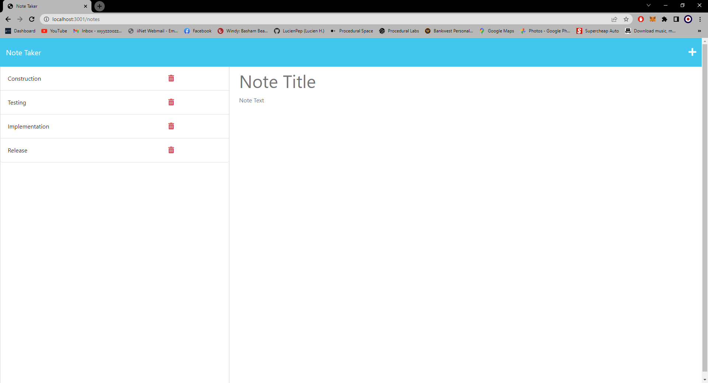

# Homework Week 11
## Online-NotePad

I had to modify starter code to create an application called Note Taker that can be used to write and save notes. This application will use an Express.js back end and will save and retrieve note data from a JSON file.

The application’s front end was already supplied. So I had to build the back end, connect the two, and then deploy the entire application to Heroku.

### User Story
```
AS A small business owner
I WANT to be able to write and save notes
SO THAT I can organize my thoughts and keep track of tasks I need to complete
```

### Table of Contents
1. [Acceptance Criteria](#acceptance-criteria)
2. [Work Description](#work-description)
3. [Screenshot](#screenshot)
4. [Installation](#installation)
5. [Usage](#usage)
6. [License](#license)
7. [Questions](#questions)

### Acceptance Criteria
```
GIVEN a note-taking application
WHEN I open the Note Taker
THEN I am presented with a landing page with a link to a notes page
WHEN I click on the link to the notes page
THEN I am presented with a page with existing notes listed in the left-hand column, plus empty fields to enter a new note title and the note’s text in the right-hand column
WHEN I enter a new note title and the note’s text
THEN a Save icon appears in the navigation at the top of the page
WHEN I click on the Save icon
THEN the new note I have entered is saved and appears in the left-hand column with the other existing notes
WHEN I click on an existing note in the list in the left-hand column
THEN that note appears in the right-hand column
WHEN I click on the Write icon in the navigation at the top of the page
THEN I am presented with empty fields to enter a new note title and the note’s text in the right-hand column
```

---
[](https://opensource.org/licenses/MIT)

### Work Description
I started by looking at the provided code and working out how it functions. I then created the home page and link into the notes page from there I was able to create the /api index route page and extend that into the /notes route. I then created the get request for notes to input the required db.json file data onto the page. Next I created the post request and was unable to get it functioning correctly and had to have a tutor lesson to decipher where I went wrong. After finding the issue with the tutor I was able to continue and complete successfully the post request and input the posted data into the db.json. Next I wanted to add the delete function after researching how these work I built the function and was initially successful although I was having issues with the db.json file not reloading if I added data in with the post method, after much trial and error I was able to figure out that my issue was the function I was using to get the data from the .json file. After that was functioning I cleaned up the code and made the webpage refresh after each method was performed to make the user experience better.


### Screenshot


 
### Installation

For this application express and uuid need to be installed. This can be done using npm install in console.

### Usage

express is used as the call location for our server calls and routing. uuid is used to create a unique id for each input made.

### License

The license I am using for my project is<br>[MIT](https://opensource.org/licenses/MIT)

### Questions

GitHub: [Lucienpep](https://github.com/Lucienpep)<br>

For any further questions contact me via:

Email: <xxyyzzoozz@gmail.com>

---
Lucien Haines UADL 2023
  
  